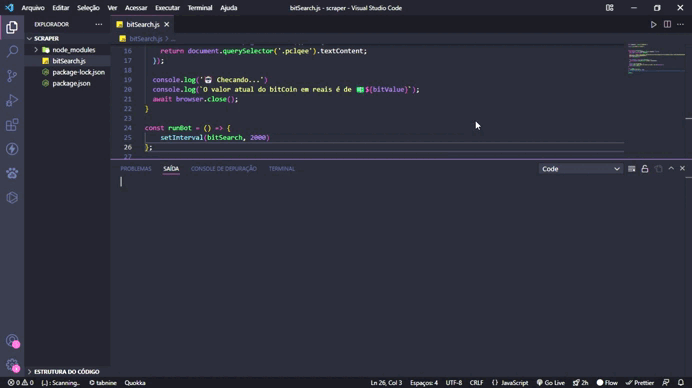

# BitBot v.1 🤖📈💲

 
 
 
 
### 🎛️ Dependencias
 
- [Puppeteer](https://pptr.dev/) - Scrapper

 
### 🎯 Objetivo
A partir de estudos em web scraping com Javascript surgiu a ideia de ajudar um amigo que sempre precisa da cotação do BitCoin para efetuar Day Trades.
 
 
### ⌨️ Como foi feito?

O core de tudo foi a utilização da lib `Puppeteer`, que serve para simular o controle a partir dos protocolos inseridos no DevTools em navegadores baseados no Chromium.

O BitBot faz a leitura de uma URL de busca no Google e retorna o valor inserido no elemento renderizado com a cotação do momento.

Eu inseri a função dentro de um `setInverval()` para que ela pudesse atualizar a cada segundo. Assim como os `console.log()` com as informações exibidas para no usuário no terminal.

 
### 🔧 Próximos passos
 
- Adicionar elemento de questionário para realizar o scraping de outras moedas

### 🎨 Autor

[LinkedIn](https://www.linkedin.com/in/fabiodeandrad/) 
[Medium](https://medium.com/@fabioscript)
[E-mail](fabiodeandradecontato@gmail.com)